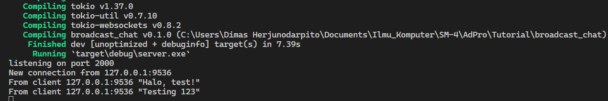
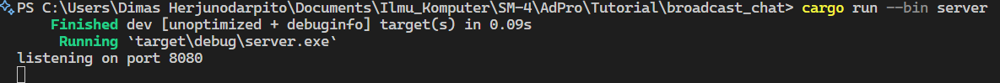

**2.1. Original code of broadcast chat.**  
  
  
After the server is run with the command `cargo run --bin server` and each client is run with the command `cargo run --bin client`, from the output above it can be seen that each client and also the server get chat broadcasts from each client. Every time a client types a message on the command line, the string will be sent to the server and the server will continue to send it to all clients connected to it.  

**2.2. Modifying the websocket port**  
When the client and server have the same port, the application will run fine just like before, which can be seen in the picture below.  
  
  

However, if for example we only change one of the ports, for example the client port, an error will occur on the client because according to the client the port does not have a connection and the program will crash when given the command `cargon run --bin client` as in the photo below.  
  
  

**2.3. Small changes. Add some information to client**  
  
The result in the photo above was achieved by changing the code in bin/server.rs to the following.  

  
The change is made so that when `bcast.tx` (which is the sender) sends a message to each subscriber it will also provide the sender IP of the text through the addr variable.  